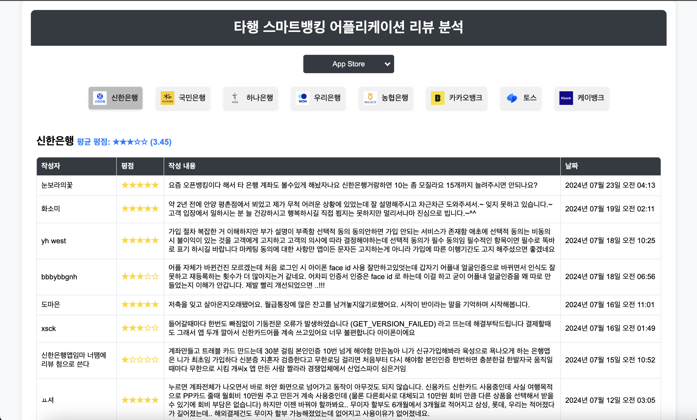
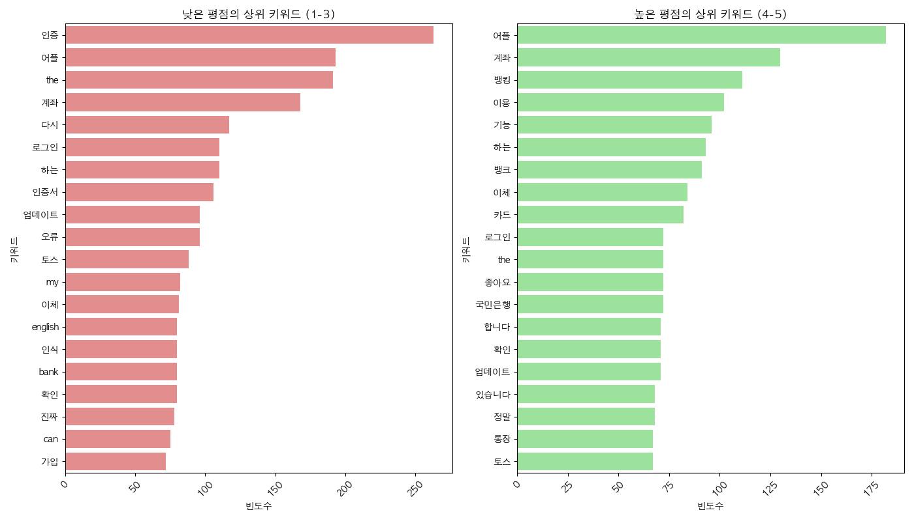

# 뱅킹 어플리케이션 리뷰 크롤링 및 웹 시각화 & 키워드 분석

이 프로젝트는 8개의 뱅킹 어플리케이션에 대한 리뷰를 Google Play 스토어와 Apple App 스토어에서 크롤링합니다. 크롤링된 리뷰는 CSV 파일로 저장되며, Flask 웹 애플리케이션을 통해 표시됩니다.

## 디렉토리 구조

```
banking-application-review/
│
├── prototype/
│   ├── app_store_crawler.py
│   ├── app_store_reviews.csv
│   ├── bank_reviews.csv
│   ├── google_play_crawler.py
│   ├── google_play_reviews.csv
│   ├── main.py
│   ├── README.md
│   └── requirements.txt
│
├─ data_analyze/
│   ├── data_loader.py
│   ├── keyword_analysis.py
│   ├── main.py
│   ├── requirements.txt
│   ├── text_preprocessing.py
│   └── visualization.py
│
└── images/
    ├── keyword_analysis.png
    └── web_dashboard.png
```

## 설정 및 사용 방법

### 1단계: 필요한 모듈 설치

먼저, 크롤링과 Flask 웹 애플리케이션 실행에 필요한 Python 모듈을 설치합니다. 루트 디렉토리에서 다음 명령어를 실행하세요:

```bash
pip install -r requirements.txt
```

### 2단계: 리뷰 크롤링

지정된 뱅킹 어플리케이션에 대해 Google Play 스토어와 Apple App 스토어에서 리뷰를 가져오려면 `main.py` 스크립트를 실행하세요:

```bash
python main.py
```

이 명령어는 `prototype/` 디렉토리에 `app_store_reviews.csv`와 `google_play_reviews.csv` 파일을 생성합니다.

### 3단계: Flask 웹 애플리케이션 실행

다음으로, `prototype/` 디렉토리로 이동하여 Flask 애플리케이션에 필요한 모듈을 설치합니다:

```bash
cd prototype
pip install -r requirements.txt
```

그런 다음 Flask 웹 애플리케이션을 실행합니다:

```bash
python app.py
```

### 4단계: 웹 애플리케이션 접속

웹 브라우저를 열고 `http://localhost:5000`으로 이동하여 리뷰를 확인합니다.



### 5단계: 데이터 분석

`data_analyze` 디렉토리로 이동하여 리뷰 데이터를 분석합니다:

```bash
cd ../data_analyze
pip install -r requirements.txt
python main.py
```

이 명령어는 상위 평점 및 하위 평점별 키워드 분석 결과를 생성하고 시각화된 차트를 출력합니다.



## 뱅킹 어플리케이션

다음 뱅킹 어플리케이션들이 포함되어 있습니다:

- 신한은행
  - App Store ID: 357484932
  - Google Play ID: com.shinhan.sbanking
- 국민은행
  - App Store ID: 373742138
  - Google Play ID: com.kbstar.kbbank
- 하나은행
  - App Store ID: 1362508015
  - Google Play ID: com.kebhana.hanapush
- 우리은행
  - App Store ID: 1470181651
  - Google Play ID: com.wooribank.smart.npib
- 농협은행
  - App Store ID: 1444712671
  - Google Play ID: nh.smart.banking
- 카카오뱅크
  - App Store ID: 1258016944
  - Google Play ID: com.kakaobank.channel
- 토스
  - App Store ID: 839333328
  - Google Play ID: viva.republica.toss
- 케이뱅크
  - App Store ID: 1178872627
  - Google Play ID: com.kbankwith.smartbank

## 파일 설명

### `prototype` 디렉토리

- `app_store_crawler.py`: Apple App 스토어에서 리뷰를 크롤링하는 스크립트.
- `google_play_crawler.py`: Google Play 스토어에서 리뷰를 크롤링하는 스크립트.
- `main.py`: 두 개의 앱 스토어에서 리뷰를 크롤링하고 CSV 파일을 생성하는 메인 스크립트.
- `app_store_reviews.csv`: Apple App 스토어에서 가져온 리뷰가 저장된 CSV 파일.
- `google_play_reviews.csv`: Google Play 스토어에서 가져온 리뷰가 저장된 CSV 파일.
- `app.py`: Flask 웹 애플리케이션 스크립트.
- `requirements.txt`: 크롤링과 웹 애플리케이션 실행에 필요한 Python 모듈 목록.
- `README.md`: 이 설명서 파일.

### `data_analyze` 디렉토리

- `data_loader.py`: 리뷰 데이터를 로드하는 스크립트.
- `keyword_analysis.py`: 키워드 분석을 수행하는 스크립트.
- `main.py`: 데이터 로딩, 전처리, 키워드 분석, 시각화를 수행하는 메인 스크립트.
- `requirements.txt`: 데이터 분석에 필요한 Python 모듈 목록.
- `text_preprocessing.py`: 리뷰 텍스트를 전처리하는 스크립트.
- `visualization.py`: 키워드 분석 결과를 시각화하는 스크립트.

## 주의사항

Python 3.x 버전이 설치되어 있어야 합니다. 이 스크립트와 Flask 애플리케이션은 Python 3.10 버전에서 테스트되었습니다.

이슈나 기여 사항이 있으면 프로젝트의 GitHub 저장소에 이슈를 열거나 풀 리퀘스트를 제출해 주세요.
